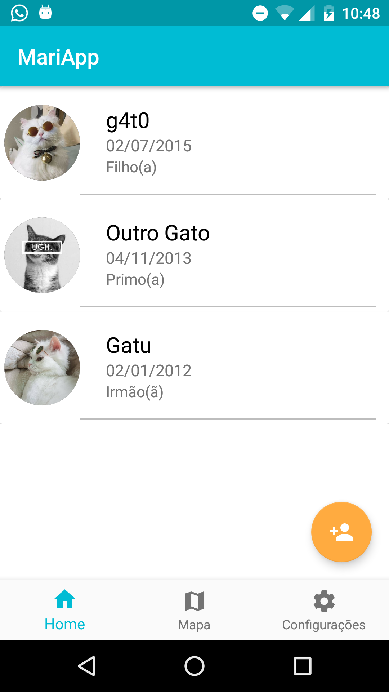
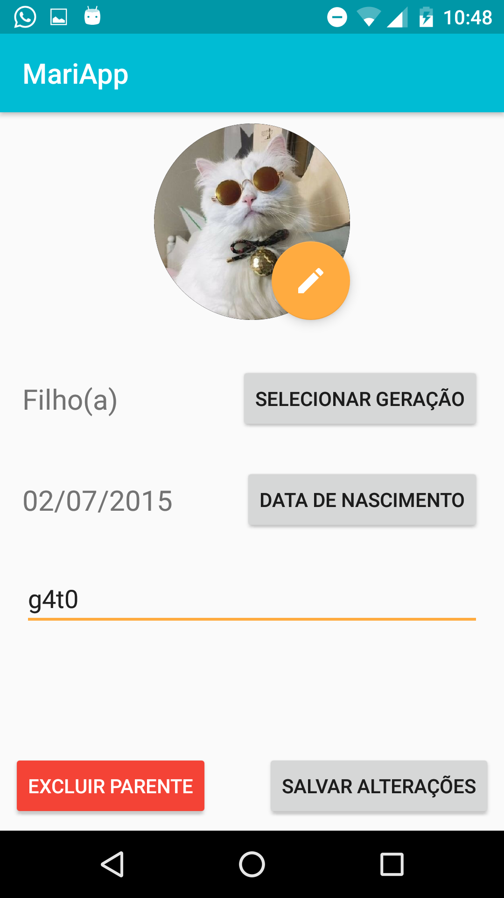

# MariApp

O projeto está dividido em duas partes

- Servidor (que foi construído em python utilizando o framework Web2py)
- Aplicativo (que foi construído no Android studio utilizando a linguagem Kotlin)

Para utilizar o app é necessário primeiro iniciar o servidor, para isso é preciso ter a pasta "web2py",
que pode ser baixada através do link:

http://www.web2py.com/init/default/download

Uma vez baixado o web2py é necessário que o arquivo MariAppPy (que está disponível neste repositório)
seja copiado para a pasta "applications" que se encontra dentro da pasta web2py, baixada anteriormente.
Uma vez que estes passos foram seguidos é necessário iniciar o web2py, para isso basta clicar duas
vezes no arquivo "web2py.py", tambem presente na pasta web2py.

Ao clicar no arquivo "web2py.py" um menu sera aberto, neste menu são exibidas várias opções, a opção
"Public(0.0.0.0)" deve ser escolhida (esta é a última opção do menu quando lido de cima para baixo).
em seguida o campo "Server Port" deve ser preenchido com o valor "8000", o preenchimento do campo
"Choose Password" serve apenas para definir uma senha para que as pessoas que estão no mesmo wi-fi
nao alterem o código, seu preenchimento é opcional.

Agora temos o servidor ligado, o próximo passo é colocar o endereço do servidor no aplicativo,
tendo o app instalado em um celular é necessário selecionar a opção "Configurações" no menu inferior,
preencher o campo com o endereço do servidor, e apertar o botão "Alterar", o endereço colocado será
salvo e não mudará até que este processo seja repetido mudando o valor anteriormente aplicado

